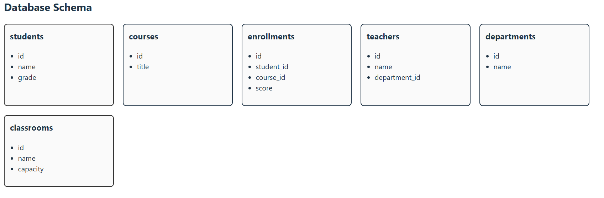
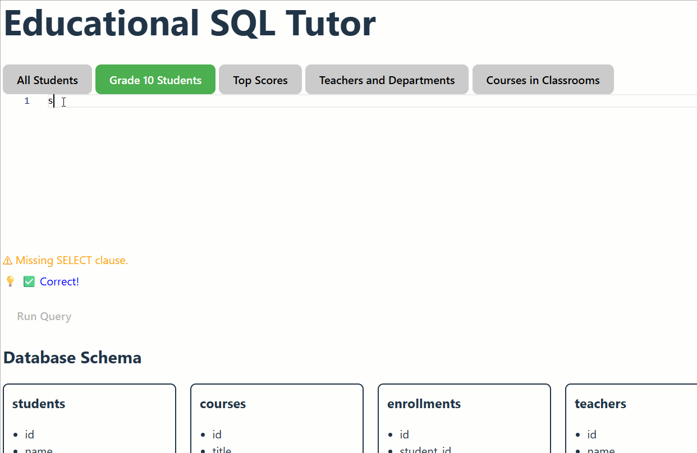
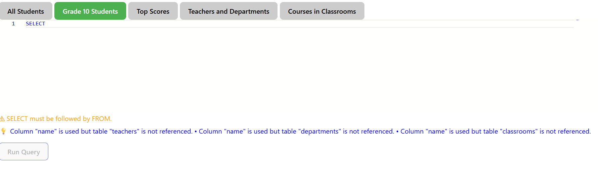

# SQLTutor 🎓

**Interactive SQL learning tool** with **real-time syntax validation, semantic hints, execution visualization**, and a **feedback survey**.  

**Bachelor of Science Thesis Project**  
Department of Computing and Digital, University Centre Rotherham, UK  

[Live Demo](https://jessyjames2509.github.io/SQLTutor---thesis)

---

## Table of Contents

1. [Project Overview](#project-overview)  
2. [Features](#features)  
3. [Technology Stack](#technology-stack)  
4. [Quickstart / Usage](#quickstart--usage)  
5. [Installation & Deployment](#installation--deployment)  
6. [Feedback and Contributions](#feedback-and-contributions)  
7. [Screenshots](#screenshots)  
8. [License](#license)  
9. [Academic References](#academic-references)  

---

## Project Overview

SQLTutor is an interactive web-based SQL learning environment designed to address common challenges in learning SQL:

- Syntax, logic, and semantic errors  
- Lack of immediate feedback in traditional tools  
- Difficulties visualizing query execution  

By providing **real-time debugging hints** and **step-by-step query visualization**, SQLTutor supports **error-based learning**, reduces cognitive load, and aligns with **Constructivist** and **Cognitive Load theories**.

---

## Features

- **Live SQL syntax validation**  
- **Semantic error detection and hints**  
- **Interactive schema visualization**  
- **Animated, step-by-step query execution**  
- **Built-in exercises with expected outputs**  
- **Offline SQL execution via sql.js (WebAssembly)**  
- **Horizontal layout** for Query Breakdown, Execution Steps, and Results  
- **Feedback button** with survey modal  
- Lightweight, accessible, and open-source  

**Design Highlights:**  

- Real-time debugging of missing clauses, logical errors, or incorrect syntax  
- Visualization of table relationships and query execution flow  
- Focus on learning and comprehension rather than gamification rewards  

---

## Technology Stack

- **Frontend:** React + TypeScript  
- **Editor:** Monaco Editor  
- **Database Engine:** SQLite via sql.js (WASM)  
- **Visualization:** SVG + React-driven schema and execution animations  

---

## Quickstart / Usage

1. Select an exercise from the buttons at the top.  
2. Write your SQL query in the editor.  
3. Run the query using the **"Run Query"** button.  
4. Observe:  
   - Syntax errors (orange warnings)  
   - Semantic hints (blue feedback)  
   - Query execution steps (highlighted schema & step animation)  
5. Provide feedback via the **"Give Feedback"** button.  

---

## Installation & Deployment

### Prerequisites

- Node.js v16+  
- npm or yarn  

### Local Installation

```bash
git clone https://github.com/JessyJames2509/SQLTutor---thesis.git
cd SQLTutor---thesis/sql-playground
npm install
npm run dev
Open your browser at the URL shown in the terminal (default: http://localhost:5173).

Build & Deploy to GitHub Pages
bash
Copy code
npm run build
npm run deploy

---
## Feedback and Contributions

- SQL correctness and edge cases  
- Suggestions for additional exercises, visualizations, or debugging support  

Submit feedback via [GitHub Issues](https://github.com/JessyJames2509/SQLTutor---thesis/issues).

---

## Screenshots

  
  
  


---

## License

MIT License — see the [LICENSE](LICENSE) file for details.

---

## Academic References

- Del-Pozo-Arcos, B., & Balderas, L. (2024). SQL Learning Challenges.  
- Miedema, A. (2024). Novice SQL Misconceptions.  
- Leventidis, V. et al. (2020). QueryVis: Visualization Tools for SQL.  
- Sweller, J. et al. (2019). Cognitive Load Theory in Learning.  
- Hattie, J., & Timperley, H. (2007). The Power of Feedback.  